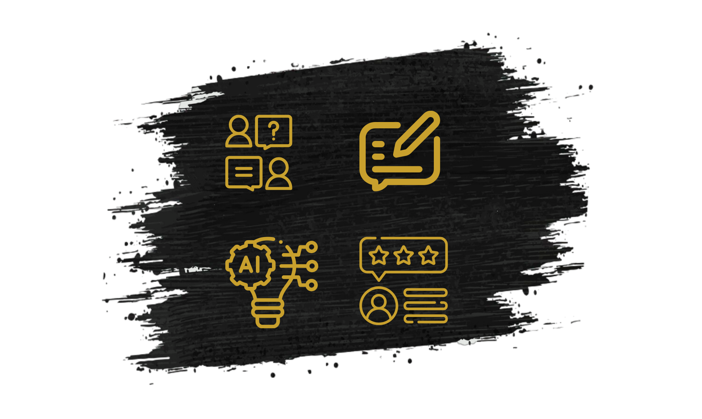

<<<<<<< HEAD
# 🤖 AI Interview Simulator

Welcome to the future of interview preparation! Our AI-powered mock interview platform helps you sharpen your skills and boost your confidence.



## 🚀 Features

- **Realistic AI Interviews**: Experience lifelike interview scenarios powered by advanced AI.
- **Personalized Feedback**: Receive instant, detailed feedback on your performance.
- **Diverse Question Bank**: Practice with wide range of industry-specific questions.
- **Progress Tracking**: Monitor your improvement over time.(🔴 Upcoming)
- **Video Recording**: Review your body language and verbal responses.(🔴 Upcoming)

## 🛠️ Tech Stack

<details>
<summary>Click to expand</summary>

- Next.js
- React
- Tailwind CSS
- Gemini AI Model
- Drizzle ORM
- Magic UI components

</details>

## 🏗️ Project Structure

<details>
<summary>Click to see the project layout</summary>

└── 📁interviewgenie

   └── 📁app

   └── 📁ComponentHelper

   └── 📁components

   └── 📁lib

   └── 📁public

   └── 📁utils


</details>

## 🚦 Getting Started
1. Clone the repository:
   ```bash
   git clone https://github.com/your-username/ai-interview-simulator.git

2. Install dependencies:
    ```bash
    cd ai-interview-simulator
    npm install

3. Set up environment variables:
     ```bash
     cp .env.example .env.local
  Edit .env.local with your API keys and configuration.

4. Run the development server:
     ```bash
     npm run dev

## 💡 Usage

<details>
  <summary>Click to see project usage</summary>

1. 👤 **Create an Account**: Sign up or log in to access the dashboard.
2. 🆕 **Start a New Interview**: Choose your industry and difficulty level.
3. 🎙️ **Answer Questions**: Respond to AI-generated questions via text or video.
4. 📊 **Receive Feedback**: Get instant AI-powered feedback on your responses.
5. 📈 **Review and Improve**: Analyze your performance and practice weak areas.

</details>

## 🤝 Contributing
We welcome contributions! Please check out our Contribution Guide for details on how to get started.

## 📄 License
This project is licensed under the MIT License - see the LICENSE file for details.

=======
# aiinterview
>>>>>>> origin/main
